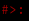
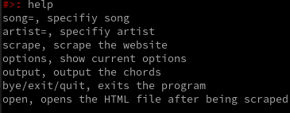

# **Ultimate Guitar Scraper**

---

Ultimate Guitar Scraper is an MIT licensed project, which scrapes the site according to specifications, and get for you the chords.

## Features

---

- Search by song

- Search by artist

- Autoscroll 

- Centered chords

## Manual

---

You of-course need python, version>=3.7.

To start scraping you need to run cli.py, which interacts with the scraper.py.

Here is the help message when running `python cli.py --help`:

```
usage: cli.py [-h] [-s] [-S SONG] [-a ARTIST] [-o] [--webdriver WEBDRIVER] [-b BROWSER]

Scrape Ultimate Guitar website with no tracking (less at least), fast and easy, and lightweight. You can use the
shell provided with the program, or parse arguments and get instant results. Enjoy!

optional arguments:
  -h, --help            show this help message and exit
  -s, --shell           Spawn a shell
  -S SONG, --song SONG  Provide song
  -a ARTIST, --artist ARTIST
                        Provide artist
  -o, --open            Open HTML file in browser after scraped
  --webdriver WEBDRIVER
                        Specify webdriver
  -b BROWSER, --browser BROWSER
                        Specify browser (default is Chrome)
```

`-s/--shell` is specifying if you want to use the shell provided with the program,

or just pass args.

`-S/--song` is for specifying which song you want to search for (only when shell=False). 

`-a/--artist` same as `-S` only for artist.

`-o/--open` is for opening the HTML file after being scraped and output.

`--webdriver` is for specifying location of the webdriver if you don't want to download another one

### Shell = TRUE

When `shell=True` (specified `--shell`), a "holder" will appear for you:



You then can type commands, to get for you the chords.

When typing `help`, you will get a list of the current supported commands:



**ATTENTION**: Currently you must specify song and artist, otherwise you get errors.

# Docs

---

The program is running with Selenium to get the source code of the site, since I need javascript to be rendered.
Beautifulsoup is used for scraping.
The program is a bit heavy, that's why it can take some time to scrape.
So to solve it with the easy way, I did that everytime you search a song and scrape it, the chords will be cached in a folder.
Also, I added a folder which has in it a firefox profile. It uses uBlock origin to block javascript and other requests, which without it- it takes much longer to scrape since there is so many requests.
On some computers if you run it multiple times, selenium can complain and say "No space left on device", since for some reason- the RAM is getting full :/.

# WARNING!!

---

I'm **<mark>not</mark>** responsible for **<mark>any</mark>** potential bad use of the program, it's just for **fun**, and for testing my programming skills. Please **do not** use it to harm.

# Contact

---

Currently, no contact service.
